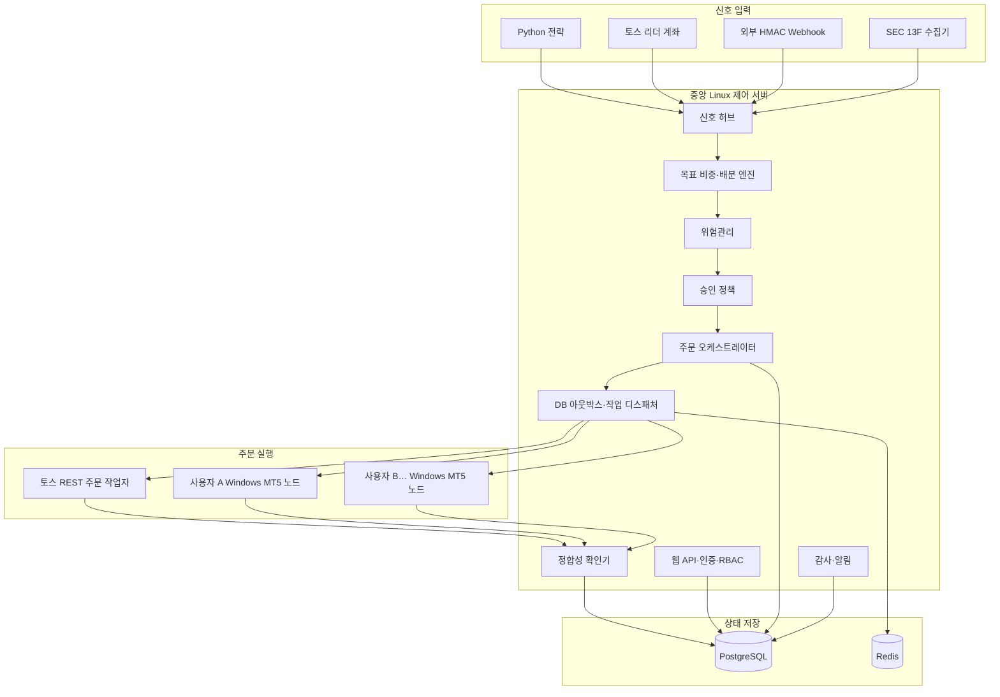

# MT5·토스증권 시스템 트레이딩 플랫폼 설계

- 작성일: 2026-08-18
- 상태: 사용자 승인 완료, 구현 계획 작성 전
- 대상 규모: 초기 2~5명, 최대 10명
- 거래 주기: 1분봉 이상
- 운영 성격: 본인·가족·내부 팀이 무료로 사용하는 비공개 도구
- 화면 상세 설계: `2026-08-18-claude-design-ui-spec.md`

## 1. 목표와 범위

이 시스템은 하나의 중앙 제어 서버에서 전략, 카피 신호, 위험 한도, 승인 정책을 관리하고 다음 두 주문 채널을 독립적으로 실행한다.

- MT5: FX·CFD 거래. 관리자가 제공한 Python 전략을 중앙에서 실행하고, 사용자별 Windows MT5 노드가 주문을 수행한다.
- 토스증권 Open API: 국내·미국 주식 거래. 리더 계좌, 외부 신호, 13F 공시 기반 목표 포트폴리오를 사용자 계좌에 맞게 복제한다.

사용자는 임의의 Python 코드를 올릴 수 없다. 관리자가 등록한 버전 고정 전략을 선택하고, 전략이 공개한 설정 스키마 안에서 종목, 주기, 투자금, 손절 기준 등의 값만 변경한다.

MVP에는 다음 네 가지 신호원이 모두 포함된다.

1. 관리자 제공 Python 전략
2. 시스템에 연결된 토스 리더 계좌
3. HMAC 서명 Webhook 방식의 외부 신호
4. SEC EDGAR Form 13F 기반 포트폴리오 추종

### 제외 범위

- 외부 고객 가입, 결제, 성과보수, 공개 리더보드
- 사용자가 Python 코드를 업로드하는 기능
- 웹앱에서 임의 종목을 직접 매수·매도하는 수동 주문 화면
- 틱 단위 고빈도 매매
- 토스증권 WebSocket 시세 연동. 현재 공식 Open API는 REST 방식이다.
- 마이크로서비스, Kafka, Kubernetes 등 현재 규모에 불필요한 운영 계층

서비스가 향후 외부 고객이나 유료 모델로 확장되면 투자자문·일임을 포함한 별도 법률·규제 검토를 먼저 수행해야 한다. 이 문서는 비공개·무상 내부 사용만을 전제로 한다.

## 2. 핵심 설계 결정

| 영역 | 결정 |
|---|---|
| 전체 구조 | 모듈형 단일 중앙 서버 + 영속 작업 큐 + 분리된 주문 실행기 |
| 배치 | 중앙 Linux 서버 + 사용자별 Windows MT5 노드 |
| MT5 전략 | 관리자 제공 Python 전략, 사용자는 설정값만 변경 |
| 토스 카피 방식 | 주문 수량 복제가 아닌 목표 포트폴리오 비중 동기화 |
| 승인 | 사용자·신호원별 자동/수동 승인 선택 |
| 실행 보장 | 최소 한 번 전달 + 멱등 소비로 실질적인 단일 실행 보장 |
| 최종 사실 | 내부 계산값이 아니라 브로커의 주문·체결·포지션 조회 결과 |
| 긴급 제어 | 신규 주문 정지와 전량 청산을 별도 기능으로 분리 |
| 데이터 | PostgreSQL이 시스템 오브 레코드, Redis는 큐·캐시·임시 잠금 |
| 출시 | 자체 모의 브로커 → 섀도 운영 → 한 계좌 제한 실거래 → 사용자 순차 확대 |

## 3. 전체 아키텍처



전략과 신호원은 브로커 API를 호출할 권한이 없다. 위험관리 결과와 승인 증거를 가진 주문 오케스트레이터만 `ExecutionIntent`를 만들 수 있다. 실행기는 허용된 의도를 브로커 형식으로 변환하고 결과를 반환하는 역할만 한다.

## 4. 중앙 서버 구성요소

### 4.1 웹 API와 인증

- 초대 전용 사용자 등록
- 관리자, 트레이더, 조회 전용 역할
- MFA는 TOTP 또는 패스키를 사용하며 실거래 계정에는 필수
- 계좌·전략·주문 데이터는 항상 `owner_user_id` 범위로 조회
- 전량 청산, 전체 정지 해제, 자격증명 교체는 재인증 필요
- 토스 비밀값은 저장 후 다시 표시하지 않으며 로그에서도 제거

관리자는 전략과 시스템 정책을 관리할 수 있지만 저장된 브로커 비밀값 원문은 볼 수 없다. 트레이더는 자신의 계좌, 전략 설정, 카피 구독, 위험 한도, 승인 요청만 관리한다. 조회 전용 사용자는 관리자가 허용한 범위만 읽을 수 있다.

### 4.2 전략 레지스트리와 실행기

각 전략 버전은 다음 정보를 가진다.

- 불변 `strategy_version_id`
- 실행 가능한 컨테이너 이미지 또는 잠긴 패키지 해시
- 설정 JSON Schema
- 지원 시장, 종목, 주기
- 필요한 데이터 필드와 최소 과거 구간
- 기본 신호 유효시간
- 백테스트 결과와 승인자

전략 프로세스는 브로커 자격증명과 운영 DB에 접근할 수 없다. 읽기 전용 시장 데이터와 사용자 설정을 입력받고 `TradeSignal` 또는 `TargetPortfolio`만 출력한다. 네트워크, 파일, CPU, 메모리, 실행시간을 제한하여 관리자 코드의 실수도 주문 시스템으로 확산되지 않게 한다.

1분봉 전략은 완성된 봉이 저장된 후 한 번만 실행한다. 동일한 데이터, 설정, 전략 버전으로 재실행하면 같은 신호가 나와야 한다. 숫자 계산에는 이진 부동소수점 대신 `Decimal`을 사용한다.

### 4.3 신호 허브

모든 신호는 아래 공통 계약으로 변환된다.

```text
TradeSignal
- signal_id
- source_type: STRATEGY | LEADER | EXTERNAL | FORM_13F
- source_id, source_version
- generated_at, observed_at, expires_at
- market, symbol, currency
- intent: TARGET_WEIGHT | TARGET_QUANTITY | CLOSE
- target_value
- confidence_metadata
- raw_payload_hash
- trace_id
```

허브는 원본 페이로드 해시, 공급자 이벤트 ID, 신호 버전으로 중복과 재전송을 제거한다. 만료된 신호는 주문 계획을 만들지 않는다. 초기 유효시간은 Python·리더·외부 신호 90초, 13F 목표 7일이며 관리자는 신호원 정책 안에서 조정할 수 있다.

### 4.4 목표 포트폴리오·배분 엔진

토스 카피트레이딩은 리더가 주문한 수량을 그대로 복제하지 않는다. 브로커에서 확인된 리더 포지션을 평가해 종목별 목표 비중을 만들고 팔로워의 순자산, 현금, 환율, 현재 보유량, 위험 한도에 맞춰 주문 차이를 계산한다.

- KR·US 주식 MVP 주문은 정수 주 단위로 내림 처리한다.
- 매도 계획을 먼저 실행·확인한 뒤 사용 가능 현금으로 매수 계획을 계산한다.
- 계좌별로 동시에 하나의 리밸런싱 계획만 실행한다.
- 더 새로운 목표 버전이 도착하면 아직 브로커에 제출하지 않은 이전 주문은 폐기하고 재계산한다.
- 이미 제출된 주문은 취소 가능 여부를 확인한 뒤 정합성 처리한다.
- 최소 주문 금액보다 작은 차이는 드리프트로 기록하고 다음 리밸런싱까지 이월한다.

MT5 전략은 종목의 최소 랏, 랏 스텝, 마진, 스프레드, 계좌 레버리지를 Windows 노드에서 다시 조회해 실행 수량을 확정한다.

### 4.5 위험관리

위험 한도는 시스템 → 사용자 → 계좌 → 전략·신호원 → 종목 순서로 적용한다. 겹치는 한도 중 주문을 더 작게 만드는 값이 우선한다.

필수 검사:

- 1회 주문 금액·수량
- 종목, 전략, 신호원별 최대 비중
- 계좌 투자금과 매수 가능 금액
- MT5 최대 랏과 레버리지
- 일일 손실과 최대 낙폭
- 가격·캔들 신선도와 예상 슬리피지
- 거래시간, 휴장일, 종목 거래 제한
- 연속 주문 실패, 포지션 불일치, 수동 거래 충돌
- MT5 노드 상태, 브로커 응답 지연, API 호출 한도, 큐 적체

실거래 활성화 전에 사용자는 계좌 투자금, 1회 주문, 종목 비중, 일일 손실, 최대 낙폭 한도를 반드시 입력해야 한다. 시스템은 수익을 암시하는 기본 한도값을 제공하지 않는다. 한도 초과 주문은 정책에 따라 명시적으로 축소하거나 거절하고, 계산 근거를 저장한다.

### 4.6 승인 정책

승인 모드는 사용자와 신호원의 조합별로 설정한다.

- 자동: 위험 한도 안의 주문은 바로 실행
- 수동: 예상 수량, 가격, 금액, 수수료, 적용 한도, 만료 시간을 보여주고 승인 대기
- 조건부 자동: 설정된 금액·비중 이하만 자동, 그 이상은 수동

초기 안전 기본값은 리더 계좌 `수동`, 외부 Webhook `수동`, 13F `수동`, Python 전략 `수동`이다. 사용자가 각 신호원의 섀도·제한 실거래 검증을 마친 후 자동 또는 조건부 자동으로 전환한다. 승인 시점에 가격과 계좌 상태가 달라졌으면 기존 주문을 그대로 보내지 않고 위험 검사를 다시 수행한다.

### 4.7 주문 오케스트레이터

각 주문에는 사용자, 계좌, 신호, 목표 버전, 종목, 방향을 포함한 결정적 멱등키를 부여한다. PostgreSQL 유일 제약으로 같은 의도에서 주문이 두 번 생성되는 것을 막는다. 계좌별 DB 잠금 또는 lease를 사용해 겹치는 리밸런싱을 직렬화한다.

주문 상태는 다음 상태머신을 따른다.

```text
CREATED
  -> PENDING_APPROVAL
  -> QUEUED
  -> SUBMITTED
  -> PARTIALLY_FILLED
  -> FILLED
  -> CANCELED | REJECTED | EXPIRED
  -> UNKNOWN (브로커 결과 확인 필요)
```

`UNKNOWN`은 실패가 아니다. 주문 전송 후 응답을 받지 못해 결과가 불명확한 상태다. 이 경우 재주문하지 않고 같은 `clientOrderId`, 주문 내역, 체결 내역, 포지션을 먼저 조회한다. 해결될 때까지 해당 계좌·종목의 충돌 주문을 차단한다.

PostgreSQL 트랜잭션 안에서 주문과 아웃박스 이벤트를 함께 저장한다. 별도 디스패처가 Redis 작업 큐에 전달하며, 실행기는 중복 메시지를 받아도 같은 멱등키를 다시 실행하지 않는다. Redis 장애 시 PostgreSQL의 미전송 아웃박스를 재처리한다.

### 4.8 정합성 확인기

브로커 상태를 최종 사실로 취급한다.

- 토스 미체결 주문은 시장 중 15초 이내 주기로 확인
- 토스 보유 자산은 60초 이내 주기로 확인하고 주문 체결 직후 추가 확인
- MT5 노드는 주문·체결 이벤트를 즉시 전송하고 30초마다 포지션 스냅샷 전송
- 수량, 평균가격, 주문 상태가 다르면 `ReconciliationIssue` 생성
- 사용자가 토스 앱이나 MT5 터미널에서 수동 거래하면 자동으로 되돌리지 않고 카피·전략을 일시정지한 뒤 재동기화 승인 요청

## 5. 신호원별 설계

### 5.1 중앙 Python 전략

MT5 Windows 노드는 완성된 1분봉과 종목 메타데이터를 중앙 시장 데이터 저장소로 보낸다. 토스 시세는 중앙 수집기가 종목별로 한 번만 조회해 여러 사용자 전략에 재사용한다. 전략은 브로커별 심볼을 내부 표준 종목 ID로 변환한 데이터를 사용한다.

전략 출력은 주문이 아니라 목표 비중 또는 포지션 목표다. 중앙 위험관리 후 MT5용 `ExecutionIntent`가 만들어지며, 노드는 `order_check`와 계좌·심볼 상태를 다시 검사한 뒤 `order_send`를 실행한다.

### 5.2 토스 리더 계좌

토스 Open API가 현재 REST만 제공하므로 리더의 주문·보유 상태를 폴링한다. 리더 주문 변화를 빠르게 감지하되, 팔로워 목표는 리더 주문 접수가 아니라 확인된 체결·보유 포지션을 기준으로 갱신한다.

- 주문 내역: 시장 중 기본 5초 주기, 공식 응답 헤더의 호출 한도에 따라 동적 완화
- 보유 자산: 기본 30초 주기 및 체결 감지 직후 조회
- 목표 비중: 리더 순자산 대비 종목 평가금액
- 현금, 미지원 종목, 거래 정지 종목은 복제 대상에서 제외하고 사유 표시

### 5.3 외부 신호

MVP는 특정 업체에 종속되지 않는 `POST /webhooks/signals/{provider}` 계약을 제공한다.

- HMAC 서명, 타임스탬프, nonce, 공급자 이벤트 ID 필수
- 허용 시간 밖의 요청과 nonce 재사용 거절
- 공급자별 종목·방향·수량 표현을 공통 신호로 변환
- 원본 본문과 정규화 결과의 해시를 감사 로그에 보존
- 공급자별 속도 제한과 회로 차단기 적용

향후 특정 신호 서비스의 pull API가 필요하면 신호 허브 앞에 provider adapter만 추가한다. 주문·위험관리 계층은 변경하지 않는다.

### 5.4 Form 13F 추종

SEC EDGAR에서 선택한 기관의 13F-HR 및 수정 신고를 수집한다. Form 13F는 분기 말 이후 최대 45일 뒤 제출될 수 있으므로 실시간 카피가 아닌 느린 리밸런싱 전략으로만 표시한다.

- EDGAR 요청에는 시스템 식별이 가능한 User-Agent를 포함
- 전체 요청은 SEC 공정 접근 지침보다 낮은 초당 5회로 제한
- 원본 filing accession, 보고 분기, 접수 시각, 수정 여부를 저장
- 정보표의 시장가치를 사용해 목표 비중 계산
- 옵션, `PUT/CALL` 표시 종목, 토스에서 거래 불가능한 종목, 매핑 실패 종목은 제외
- CUSIP·발행사·종목 매핑은 관리자 검토 테이블로 관리하며 불확실한 자동 매핑은 주문에 사용하지 않음
- 새 filing 수집 후 자동 주문하지 않고 기본적으로 관리자 검토와 사용자 수동 승인을 요구
- 수정 신고가 오면 새 목표 버전으로 계산하고 이전 계획과 차이를 표시

## 6. 브로커 실행기

### 6.1 토스증권 작업자

토스 작업자는 OAuth 2.0 Client Credentials 토큰과 계좌 식별 헤더를 사용한다. 비밀값은 클라우드 키 관리 서비스로 암호화하고 주문 작업자만 메모리에서 일시 복호화한다.

처리 규칙:

- `clientOrderId`에 내부 멱등키 사용
- 주문 전 매수 가능 금액, 판매 가능 수량, 거래시간, 종목 제한 확인
- 429는 `Retry-After`와 `X-RateLimit-*` 헤더를 따라 jitter를 포함한 지수 백오프
- 400·403·404·422 같은 업무 오류는 자동 재시도하지 않고 명시적 거절 사유 저장
- 500·maintenance는 신호 만료시간 안에서 제한 재시도
- POST 타임아웃은 재전송보다 주문 내역 조회 우선
- 공식 `X-Request-Id`를 로그에 저장해 장애 추적 가능하게 함

### 6.2 Windows MT5 노드

각 사용자는 자신의 Windows PC 또는 개인 Windows VPS에 하나의 실행 노드를 설치한다.

- MT5 터미널과 MetaTrader5 Python 패키지는 로컬에서 동작
- MT5 계정 비밀번호는 Windows 자격증명 저장소 또는 터미널에만 저장
- 노드는 외부에서 들어오는 포트를 열지 않고 중앙 서버로 WSS 연결
- 노드별 인증서와 단기 토큰으로 상호 인증
- 10초마다 heartbeat, 30초 이상 응답이 없으면 `OFFLINE`
- 실행 요청은 서명, 만료시간, 계좌 ID, 전략 버전, 멱등키를 검증
- `order_check` 성공 후에만 `order_send`
- 주문 결과와 `last_error`, 포지션 스냅샷을 중앙에 전송
- 중앙 서버가 끊기면 캐시된 오래된 주문을 실행하지 않으며 새 주문은 fail-closed

하나의 Windows 노드에 여러 사용자의 MT5 계정을 섞지 않는다. 한 사용자가 계정을 여러 개 연결하면 터미널 인스턴스와 로컬 데이터 디렉터리를 계정별로 분리한다.

## 7. 데이터 설계

핵심 테이블은 다음과 같다.

- `users`, `roles`, `user_roles`, `sessions`, `mfa_credentials`
- `broker_accounts`, `credential_refs`, `mt5_nodes`, `node_heartbeats`
- `strategies`, `strategy_versions`, `strategy_configs`, `strategy_runs`
- `signal_sources`, `subscriptions`, `raw_signals`, `normalized_signals`
- `target_portfolios`, `target_positions`, `execution_plans`
- `risk_rules`, `risk_evaluations`, `approval_requests`, `approvals`
- `order_intents`, `broker_orders`, `fills`, `position_snapshots`
- `reconciliation_issues`, `outbox_events`, `audit_events`, `notifications`
- `market_instruments`, `broker_symbol_maps`, `cusip_symbol_reviews`

주문, 체결, 승인, 위험검사, 전략 버전은 삭제하거나 덮어쓰지 않는다. 현재 상태 테이블과 별도로 append-only 감사 이벤트를 남긴다. 모든 시각은 UTC로 저장하고 화면에서 KST와 거래소 현지 시간을 함께 표시한다. 금액, 가격, 수량은 `Decimal`/고정 소수점 타입으로 저장한다.

PostgreSQL RLS 또는 동등한 강제 필터로 사용자 소유 데이터 접근을 제한한다. 감사 이벤트에는 행위자, 요청 ID, trace ID, 변경 전후 값, IP·세션, 전략·신호·주문 연결 ID를 포함한다. 비밀값과 개인정보는 기록하지 않는다.

## 8. 웹앱 정보 구조

1. 대시보드: 계좌 연결, 노드 상태, 위험 한도 사용률, 승인 대기, 최근 주문
2. 전략: 관리자 전략 선택, 설정값, 버전, 백테스트·섀도 결과, 실행·정지
3. 카피트레이딩: 리더, 외부 신호, 13F 구독과 목표 비중
4. 승인함: 주문 예상값, 위험검사, 만료시간, 승인·거절
5. 주문·포지션: 상태머신, 부분 체결, 브로커 조회 결과, 정합성 이슈
6. 위험 설정: 사용자·계좌·전략·신호원·종목 한도
7. 연결: 토스 자격증명 상태, MT5 노드 설치·heartbeat
8. 감사 기록: 신호에서 체결까지 trace ID 기반 추적
9. 관리자: 사용자 초대, 전략 배포, 공급자 설정, 전체 긴급 정지

## 9. 정지와 장애 처리

정지 수준은 네 단계다.

1. 전략·신호원 정지: 새 신호만 차단, 기존 주문·포지션 유지
2. 계좌 주문 정지: 새 주문 차단, 미체결 주문은 계좌 정책에 따라 취소
3. 전체 긴급 정지: 모든 신규 주문 차단과 미체결 주문 취소, 보유 포지션 유지
4. 전체 포지션 청산: 별도 관리자 재인증과 2단계 확인 후 실행

전량 청산은 긴급 정지의 자동 부작용이 아니다. 시장 폐장, 거래 정지, 유동성 부족 때문에 청산이 실패할 수 있으므로 주문별 결과를 추적하고 실패를 명확히 표시한다.

장애별 기본 동작:

| 장애 | 동작 |
|---|---|
| PostgreSQL 연결 실패 | 신규 주문 생성 중단, fail-closed |
| Redis 장애 | DB 아웃박스 유지, 복구 후 재전달 |
| 토스 429 | 응답 헤더 기반 완화·재시도, 신호 만료 시 종료 |
| 토스 POST 타임아웃 | `UNKNOWN`, 조회로 결과 확인 전 재전송 금지 |
| MT5 노드 offline | 해당 계좌 신규 주문 차단, 사용자 알림 |
| 시장 데이터 지연 | 해당 종목 전략·주문 중단 |
| 포지션 불일치 | 해당 계좌·종목 자동매매 정지 후 재동기화 승인 |
| 전략 프로세스 오류 | 해당 전략 실행만 격리·중단, 주문 시스템 유지 |

## 10. 기술 스택과 배포

### 중앙 서버

- Python 3.12, FastAPI, SQLAlchemy, Alembic
- 전략과 작업자: 독립 Python 프로세스 또는 제한된 컨테이너
- PostgreSQL 16: 시스템 오브 레코드
- Redis Streams: 전달 큐, consumer group, 임시 캐시와 lease
- Next.js + TypeScript: 웹앱
- Docker Compose: MVP 애플리케이션 배포
- 관리형 PostgreSQL과 클라우드 KMS·Secrets Manager 사용
- HTTPS reverse proxy, 구조화 JSON 로그, metrics, trace, 알림

### Windows 노드

- MT5 터미널
- Python 3.12 + MetaTrader5 패키지
- 자동 시작 Windows 서비스
- Windows DPAPI 또는 Credential Manager
- 중앙 서버로의 WSS outbound 연결만 허용

클라우드 제공자는 구현 계획에서 비용과 운영 편의성을 비교해 선택해도 이 인터페이스와 보안 경계는 바뀌지 않는다.

## 11. 테스트 전략

### 자동 테스트

- 전략 재현성 및 설정 스키마 검증
- 목표 비중·수량·반올림·환율 계산의 단위·property 테스트
- 위험 한도 우선순위와 경계값 테스트
- 주문 상태머신과 금지된 상태 전이 테스트
- 토스 오류 코드, 호출 한도, 부분 체결 응답의 계약 테스트
- MT5 `order_check`, `order_send`, 연결 오류 adapter 테스트
- RBAC, 사용자 데이터 격리, Webhook replay 방지 보안 테스트

### 모의·장애 테스트

자체 토스 모의 브로커는 접수, 부분 체결, 거절, 취소 경합, 타임아웃, 409, 422, 429, 500, maintenance를 재현한다. MT5는 데모 계좌를 사용한다. 메시지 중복, 순서 변경, 작업자 재시작, DB·Redis·네트워크 단절을 주입한다.

과거 재생은 수수료, 환율, 슬리피지, 한국·미국 휴장일, 서머타임, 프리·정규·애프터마켓을 포함한다. 백테스트 성능은 미래 수익 보장이 아니라 코드와 위험 동작 검증 자료로만 사용한다.

### 실거래 전환 게이트

1. 재시도·재시작·타임아웃 테스트에서 중복 주문 0건
2. 주문·체결·포지션 차이가 자동 해결되거나 명시적 수동 조치로 100% 분류
3. 긴급 정지 반복 시험에서 신규 주문 차단과 미체결 취소 누락 0건
4. 실제 데이터로 10거래일 섀도 운영 중 치명적 오류 0건
5. 한 사용자·한 계좌·사용자 지정 낮은 한도로 10거래일 제한 실거래
6. 백업에서 새 환경 복원 및 미완료 주문 상태 재구성 성공
7. 통과 후 사용자를 한 명씩 추가하며 계좌별 독립 정지를 검증

토스증권 공식 가이드에는 현재 별도 샌드박스가 문서화되어 있지 않으므로 자체 모의 브로커와 섀도 운영이 필수다. 실제 API로만 확인 가능한 항목은 낮은 투자·주문 한도와 수동 승인 아래에서 시험한다.

## 12. MVP 구현 순서

모든 신호원을 MVP에 포함하되 다음 순서로 완성한다.

1. 공통 데이터 모델, 인증·RBAC, 감사 이벤트
2. 위험관리, 승인, 주문 상태머신, DB 아웃박스
3. 모의 브로커와 정합성 확인기
4. 토스 계좌·시세·주문 adapter
5. Windows MT5 노드와 중앙 Python 전략 실행
6. 토스 리더 목표 비중 복제
7. 외부 HMAC Webhook
8. SEC 13F 수집·매핑 검토·리밸런싱
9. 웹앱 전체 화면과 긴급 제어
10. 섀도·제한 실거래·사용자 순차 확대

각 단계는 앞 단계의 상태머신과 위험·감사 계약을 재사용한다. 신호원별로 별도 주문 경로를 만들지 않는다.

## 13. 완료 기준

설계 범위의 MVP는 다음 조건을 모두 만족할 때 완료다.

- 2~5명의 사용자가 자신의 토스 계좌와 MT5 노드를 독립적으로 연결할 수 있다.
- 관리자가 배포한 Python 전략을 사용자가 설정값으로 실행할 수 있다.
- 토스 리더, 외부 Webhook, SEC 13F 목표를 계좌별 목표 비중으로 변환할 수 있다.
- 모든 주문이 위험관리, 승인, 멱등 처리, 정합성 확인, 감사 기록을 거친다.
- 브로커·노드·큐·DB 장애에서 중복 주문 없이 안전하게 중단·복구된다.
- 계좌별 정지, 전체 긴급 정지, 별도 전량 청산이 권한과 재인증 규칙대로 동작한다.
- 테스트 전략의 실거래 전환 게이트를 통과한다.

## 14. 공식 자료

- 토스증권 Open API: https://developers.tossinvest.com/docs
- 토스증권 Market Data: https://developers.tossinvest.com/docs/market-data
- MetaTrader5 Python Integration: https://www.mql5.com/en/docs/python_metatrader5
- MetaTrader5 `order_send`: https://www.mql5.com/en/docs/python_metatrader5/mt5ordersend_py
- SEC Form 13F FAQ: https://www.sec.gov/rules-regulations/staff-guidance/division-investment-management-frequently-asked-questions/frequently-asked-questions-about-form-13f
- SEC EDGAR API: https://www.sec.gov/search-filings/edgar-application-programming-interfaces
- SEC Developer Resources and Fair Access: https://www.sec.gov/about/developer-resources
